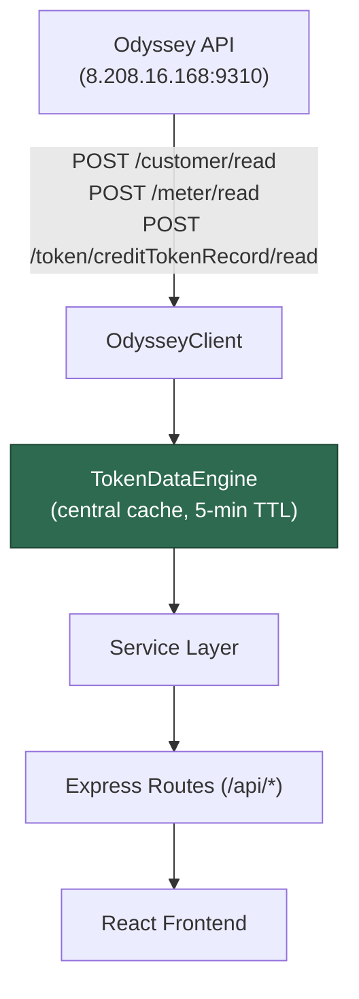

# SOP: ACOB Odyssey CRM — Complete API Reference

> **Central Data Engine**: The `TokenDataEngine` is the single source of truth.
> It mines Credit Token Records from all 5 sites to derive meters, customers, transactions, and analytics.

---

## Architecture



---

## How to Get Data from the Central Data Engine

### 1. Import the Singleton

```typescript
import { tokenDataEngine } from '../services/token-data-engine';
```

### 2. Call a Query Method

| Method | Returns | Description |
|--------|---------|-------------|
| `getSnapshot(force?)` | `EngineSnapshot` | Full snapshot (meters, customers, transactions) |
| `getMeters(siteId?)` | `DerivedMeter[]` | All meters, optionally by site |
| `getMeterDetails(meterSN)` | `{ meter, transactions, consumption }` | Single meter deep-dive |
| `getCustomers(siteId?, search?)` | `DerivedCustomer[]` | Customer list with optional text search |
| `getCustomerDetails(customerId)` | `{ customer, transactions, consumption }` | Single customer deep-dive |
| `getRecentTransactions(limit?)` | `TokenTransaction[]` | Latest N transactions |
| `getSiteStats()` | `Record<SiteId, stats>` | Revenue, kWh, counts per site |
| `getMeterStats(siteId?)` | `{ totalMeters, activeMeters, ... }` | Meter analytics |
| `getCustomerStats(siteId?)` | `{ totalCustomers, activeCustomers, ... }` | Customer analytics |
| `getNonPurchaseMeters(days?)` | `DerivedMeter[]` | Meters with no purchase in N days |
| `getLowPurchaseMeters(threshold?)` | `DerivedMeter[]` | Meters below amount threshold |
| `getConsumptionAnalytics(filters?)` | `DailyConsumptionAnalytics[]` | Day/night kWh by date |
| `getMeterConsumptionAnalytics(filters?)` | `MeterConsumptionAnalytics[]` | Per-meter kWh breakdown |
| `fetchTariffs()` | `any[]` | All tariffs from Odyssey |
| `fetchGateways()` | `any[]` | All gateways from Odyssey |

### 3. Example Usage

```typescript
// In a service or route handler:
const customers = await tokenDataEngine.getCustomers('KYAKALE');
const { meter, transactions } = await tokenDataEngine.getMeterDetails('47005309647');
const snapshot = await tokenDataEngine.getSnapshot();
const highValue = snapshot.meters.filter(m => m.totalRevenue > 50000);
```

### 4. Rules

| ✅ DO | ❌ DON'T |
|-------|---------|
| Use `tokenDataEngine` for all derived data | Call `odysseyClient` directly for data the engine provides |
| Let the 5-min cache work for you | Force-refresh unless you just wrote data |
| Pass `siteId` to filter server-side | Store results in your own long-lived cache |
| Wrap calls in try/catch | Ignore errors — the engine logs but still throws |

---

## Complete REST API Endpoint Reference

All endpoints return `{ success: boolean, data: ..., total?: number }`.

---

### 🔐 Auth — `/api/auth`

| Method | Endpoint | Body / Params | Description |
|--------|----------|---------------|-------------|
| POST | `/api/auth/login` | `{ username, password }` | Login, returns JWT tokens |
| POST | `/api/auth/refresh` | `{ refreshToken }` | Refresh access token |
| POST | `/api/auth/logout` | `{ refreshToken }` | Invalidate refresh token |

---

### 📊 Dashboard — `/api/dashboard`

| Method | Endpoint | Query Params | Description |
|--------|----------|--------------|-------------|
| GET | `/api/dashboard` | `from, to, siteId?` | Full dashboard KPIs (cached 5 min) |
| GET | `/api/dashboard/hourly` | `siteId?, from, to` | Hourly meter data (AMR) |
| GET | `/api/dashboard/gprs` | — | GPRS connection status for all sites |
| GET | `/api/dashboard/events` | `from, to, siteId?` | Event notifications across sites |

---

### ⚡ Meters — `/api/meters`

| Method | Endpoint | Query / Params | Description |
|--------|----------|----------------|-------------|
| GET | `/api/meters` | `siteId?` | All meters (from TokenDataEngine) |
| GET | `/api/meters/:meterSN` | — | Single meter details + transactions + consumption |
| GET | `/api/meters/:meterSN/consumption` | — | Monthly consumption timeline for a meter |
| GET | `/api/meters/stats/sites` | — | Revenue, kWh, counts aggregated per site |
| GET | `/api/meters/reports/non-purchase` | `days?` (default 30) | Meters with no purchase in N days |
| GET | `/api/meters/reports/low-purchase` | `threshold?` (default 500) | Meters below purchase threshold |

---

### 📋 Reports — `/api/reports`

| Method | Endpoint | Query Params | Description |
|--------|----------|--------------|-------------|
| GET | `/api/reports/non-purchase` | `siteId?, days?, format?` | Long non-purchase report |
| GET | `/api/reports/low-purchase` | `siteId?, threshold?, format?` | Low purchase report |
| GET | `/api/reports/consumption` | `siteId?, from, to, format?` | Consumption statistics |
| GET | `/api/reports/daily-amr` | `siteId?, from, to, format?` | Daily AMR data |
| GET | `/api/reports/daily-amr/meter` | `meterSN, siteId, from, to` | Daily AMR for a specific meter |
| GET | `/api/reports/monthly-amr` | `siteId?, from, to, format?` | Monthly AMR data |
| GET | `/api/reports/energy-curve/single` | `siteId, meterSN, from, to` | Single-phase energy curve |
| GET | `/api/reports/energy-curve/three-phase` | `siteId, meterSN, from, to` | Three-phase energy curve |
| GET | `/api/reports/energy-curve/ct` | `siteId, meterSN, from, to` | CT energy curve |
| GET | `/api/reports/daily-yield` | `siteId?, from, to, format?` | Daily yield report |
| GET | `/api/reports/monthly-yield` | `siteId?, from, to, format?` | Monthly yield report |
| GET | `/api/reports/events` | `siteId?, from, to, eventType?, format?` | Event notifications report |
| GET | `/api/reports/instantaneous` | `siteId, meterSN` | Live instantaneous meter values |

> **`format`** param: `json` (default) or `csv` for downloadable CSV export.

---

### 🏗️ Management — `/api/management`

#### Analytics & Stats

| Method | Endpoint | Query Params | Description |
|--------|----------|--------------|-------------|
| GET | `/api/management/analytics/consumption` | `siteId?, meterSN?` | Daily consumption analytics (from engine) |
| GET | `/api/management/analytics/meter-consumption` | `siteId?` | Per-meter consumption analytics |
| GET | `/api/management/stats/meters` | `siteId?` | Meter statistics (from engine) |
| GET | `/api/management/stats/customers` | `siteId?` | Customer statistics (from engine) |

#### Gateways

| Method | Endpoint | Body / Params | Description |
|--------|----------|---------------|-------------|
| GET | `/api/management/gateways` | `siteId?` | List all gateways |
| GET | `/api/management/gateways/:id` | `siteId` (query) | Get a specific gateway |
| POST | `/api/management/gateways` | `{ name, siteId, ... }` | Register a new gateway |
| PUT | `/api/management/gateways/:id` | update body | Update gateway |
| DELETE | `/api/management/gateways/:id` | `siteId` (query) | Decommission gateway |

#### Customers

| Method | Endpoint | Body / Params | Description |
|--------|----------|---------------|-------------|
| GET | `/api/management/customers` | `siteId?, search?, page?, limit?` | List customers (from engine) |
| GET | `/api/management/customers/:id` | — | Get single customer |
| GET | `/api/management/customers/:id/details` | `siteId` (query) | Full customer details (history, stats) |
| POST | `/api/management/customers` | `{ ... }` | Create / register customer |
| PUT | `/api/management/customers/:id` | update body | Update customer |

#### Tariffs

| Method | Endpoint | Body / Params | Description |
|--------|----------|---------------|-------------|
| GET | `/api/management/tariffs` | `siteId?` | List all tariffs |
| GET | `/api/management/tariffs/:id` | `siteId` (query) | Get specific tariff |
| POST | `/api/management/tariffs` | `{ name, siteId, ratePerKwh, ... }` | Create tariff |
| PUT | `/api/management/tariffs/:id` | update body | Update tariff |

#### Accounts

| Method | Endpoint | Body / Params | Description |
|--------|----------|---------------|-------------|
| GET | `/api/management/accounts` | `page?, limit?` | List user accounts (paginated) |
| POST | `/api/management/accounts` | `{ username, password, role, ... }` | Create account |
| PUT | `/api/management/accounts/:id` | update body | Update account |
| DELETE | `/api/management/accounts/:id` | — | Deactivate account |

---

### 🎫 Tokens — `/api/tokens`

| Method | Endpoint | Body / Params | Description |
|--------|----------|---------------|-------------|
| POST | `/api/tokens/credit` | `{ meterSN, amount, tariffRate, siteId, operatorId }` | Generate credit token (🔒 auth required) |
| POST | `/api/tokens/clear-tamper` | `{ meterSN, siteId, operatorId }` | Generate clear tamper token (🔒) |
| POST | `/api/tokens/clear-credit` | `{ meterSN, siteId, operatorId }` | Generate clear credit token (🔒) |
| POST | `/api/tokens/max-power` | `{ meterSN, siteId, limitKw, operatorId }` | Generate max power limit token (🔒) |
| GET | `/api/tokens/records` | `siteId? (default ALL), from, to` | Fetch credit token records |

---

### 🔧 Operations — `/api/operations`

| Method | Endpoint | Body / Params | Description |
|--------|----------|---------------|-------------|
| POST | `/api/operations/reading-task` | `{ meterSN, siteId, operatorId }` | Create remote reading task |
| POST | `/api/operations/control-task` | `{ meterSN, siteId, controlType, reason, authorizedBy, secondAuthorizer? }` | Connect/disconnect meter |
| POST | `/api/operations/token-task` | `{ meterSN, siteId, tokenValue, operatorId }` | Remote token delivery |
| POST | `/api/operations/setting-task` | `{ meterSN, siteId, settings, operatorId }` | Remote meter settings |
| GET | `/api/operations/task/:taskId` | `siteId` (query) | Poll task result |
| GET | `/api/operations/tasks` | `siteId?, limit?` | List recent tasks |

---

### ⚙️ Settings — `/api/settings`

#### Stations

| Method | Endpoint | Body / Params | Description |
|--------|----------|---------------|-------------|
| GET | `/api/settings/stations` | — | List all stations |
| GET | `/api/settings/stations/:id` | `siteId` (query) | Get station by ID |
| PUT | `/api/settings/stations/:id` | `{ siteId, ...update }` | Update station |

#### Roles

| Method | Endpoint | Body / Params | Description |
|--------|----------|---------------|-------------|
| GET | `/api/settings/roles` | — | List all roles |
| POST | `/api/settings/roles` | `{ roleName, description, scopes[] }` | Create role |
| PUT | `/api/settings/roles/:id` | update body | Update role |

#### Users

| Method | Endpoint | Body / Params | Description |
|--------|----------|---------------|-------------|
| GET | `/api/settings/users` | — | List all users |
| POST | `/api/settings/users` | `{ userName, password, roleId, realName }` | Create user |
| PUT | `/api/settings/users/:id` | update body | Update user |

#### System Logs

| Method | Endpoint | Query Params | Description |
|--------|----------|--------------|-------------|
| GET | `/api/settings/logs` | `siteId?, from?, to?` | System log entries |

---

### 🔔 Notifications — `/api/notifications`

| Method | Endpoint | Body / Params | Description |
|--------|----------|---------------|-------------|
| GET | `/api/notifications` | — | Get all notifications + unread count |
| POST | `/api/notifications` | `{ title, message, type, link?, userId? }` | Create notification |
| PATCH | `/api/notifications/:id/read` | — | Mark single notification as read |
| PATCH | `/api/notifications/read-all` | — | Mark all as read |

---

### 🩺 Diagnostics — `/api/diagnostics`

| Method | Endpoint | Params | Description |
|--------|----------|--------|-------------|
| GET | `/api/diagnostics/run-probe` | — | Run health probe on all Odyssey endpoints |

---

## Sites Configuration

| Site ID | Configured in ENV |
|---------|-------------------|
| `KYAKALE` | ✅ |
| `MUSHA` | ✅ |
| `UMAISHA` | ✅ |
| `TUNGA` | ✅ |
| `OGUFA` | ✅ |

---

## File Map

| File | Purpose |
|------|---------|
| [token-data-engine.ts](file:///c:/Users/ACOB/Desktop/VS%20Code/acob-crm2/acob-odyssey/backend/src/services/token-data-engine.ts) | **Central data engine** — singleton, cache, all query methods |
| [odyssey-client.ts](file:///c:/Users/ACOB/Desktop/VS%20Code/acob-crm2/acob-odyssey/backend/src/services/odyssey-client.ts) | HTTP client — JWT auth, retry, pagination |
| [customer-service.ts](file:///c:/Users/ACOB/Desktop/VS%20Code/acob-crm2/acob-odyssey/backend/src/services/customer-service.ts) | Customer detail aggregation |
| [report-service.ts](file:///c:/Users/ACOB/Desktop/VS%20Code/acob-crm2/acob-odyssey/backend/src/services/report-service.ts) | Report synthesis (yield, AMR, events) |
| [dashboard-service.ts](file:///c:/Users/ACOB/Desktop/VS%20Code/acob-crm2/acob-odyssey/backend/src/services/dashboard-service.ts) | Dashboard KPI computation |
| [operations-service.ts](file:///c:/Users/ACOB/Desktop/VS%20Code/acob-crm2/acob-odyssey/backend/src/services/operations-service.ts) | Remote task dispatch |
| [token-service.ts](file:///c:/Users/ACOB/Desktop/VS%20Code/acob-crm2/acob-odyssey/backend/src/services/token-service.ts) | Token generation |
| [settings-service.ts](file:///c:/Users/ACOB/Desktop/VS%20Code/acob-crm2/acob-odyssey/backend/src/services/settings-service.ts) | Stations, roles, users, logs |
| [management-service.ts](file:///c:/Users/ACOB/Desktop/VS%20Code/acob-crm2/acob-odyssey/backend/src/services/management-service.ts) | Gateway, customer, tariff, account CRUD |
| [notification-service.ts](file:///c:/Users/ACOB/Desktop/VS%20Code/acob-crm2/acob-odyssey/backend/src/services/notification-service.ts) | In-app notification management |
| [auth-service.ts](file:///c:/Users/ACOB/Desktop/VS%20Code/acob-crm2/acob-odyssey/backend/src/services/auth-service.ts) | JWT login, refresh, logout |
| [health-probe-service.ts](file:///c:/Users/ACOB/Desktop/VS%20Code/acob-crm2/acob-odyssey/backend/src/services/health-probe-service.ts) | Odyssey endpoint health checks |
| [config/index.ts](file:///c:/Users/ACOB/Desktop/VS%20Code/acob-crm2/acob-odyssey/backend/src/config/index.ts) | Site list, API base URL, JWT config |
